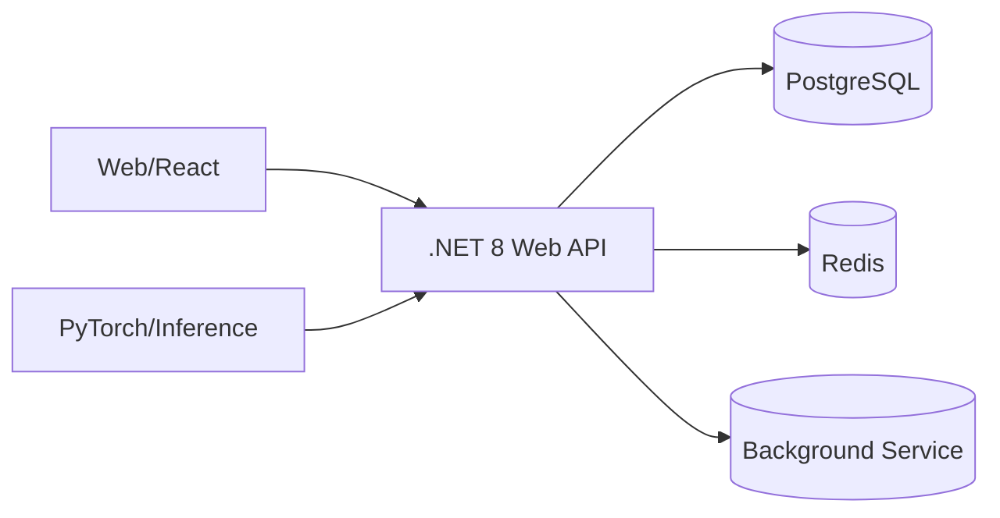
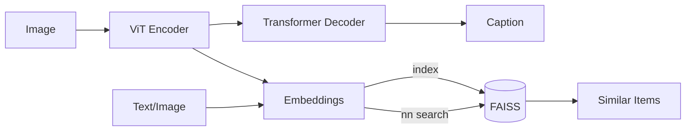

<h1 align="center">Hey, I'm Abhinandan Vijan 👋</h1>

  Software Engineer — <b>.NET/C# • Python • AI/ML • Distributed Systems</b> 
  Building reliable backends and ML‑powered apps that scale.

  
  <a href="mailto:<abhinandanvijan98@gmail.com>"></a>
  
  

---

## 🚀 About Me
- 🎓 **M.S. in Computer Science, University at Buffalo** — graduated **June 2025**
- 🧰 **3+ years @ HSBC (India)** — Senior Software Engineer on Endpoint Management & Tooling for ~400k+ devices
- 🧠 Blend of **backend engineering** (.NET 8, EF Core, SQL) and **ML systems** (Vision Transformers, NLP)
- 💡 Interests: **FinTech, platform engineering, data platforms, AI‑augmented developer tools**

## 🔧 Tech Stack
**Languages:** C#, Python, SQL, TypeScript/JavaScript

**Backend:** .NET 8, ASP.NET Core Web API, EF Core, REST, gRPC, Background Services

**Data & Infra:** SQL Server, PostgreSQL, Redis, Docker, Linux, CI/CD (GitHub Actions/Azure DevOps)

**ML/AI:** PyTorch, scikit‑learn, ViT, Transformers, FAISS, OpenAI API

**Frontend:** React, Vite, MUI (learning Next.js)

**Testing & Quality:** xUnit/NUnit, Integration Tests, Serilog, Postman

## 🧭 What I’m Focused On (now)
- Building a **Splitwise‑style expense manager** (React + .NET API) with equal/unequal/% splits & group ledgers
- Improving **PixeLens**: ViT encoder + Transformer decoder with beam search; semantic search via FAISS
- **RT‑Extension‑AI** for Request Tracker: ticket summarization, sentiment, and smart reply drafting (OpenAI)
- Writing succinct systems articles (Memcache vs Redis, caches at scale)

---

## 🌟 Featured Projects

### 1) SmartHub — Enterprise Backup/Restore Platform  
**Stack:** .NET / C# • Windows services • SQL Server • Task Scheduler • Serilog  
**Highlights:**
- Loads backup schedules from DB as JSON; runs per‑user restores across multiple machines  
- Supports multilingual UI text, dynamic config updates, and login/startup triggers  
- Designed for **scale & resilience** across a large enterprise footprint

> Impact: Reduced restore time & support friction for thousands of employees.

---

### 2) RT‑Extension‑AI (Open‑Source Contribution)  
**Stack:** Perl • JavaScript/CKEditor • OpenAI API  
**What it does:** AI add‑on for the open‑source **Request Tracker** issue system—adds ticket **summaries**, **sentiment analysis**, and **auto‑completion** for replies, improving agent productivity.

> Why it’s cool: Real‑world OSS impact; blends classic Perl stack with modern LLMs.

---

### 3) PixeLens — Vision Captioning & Semantic Search  
**Stack:** PyTorch • ViT‑B/16 encoder • Transformer decoder • FAISS • Flask/FastAPI • SQLite  
**Features:**  
- Trainable on Flickr‑8k; **beam search** decoding; BLEU/METEOR evaluation  
- **Image↔Text** and **Image↔Image** semantic retrieval via embedding search (FAISS)  
- Responsive web UI; export captions & results

> Why it shines: Showcases end‑to‑end ML product engineering.

---

### 4) Splitwise‑Clone — Group Expense Manager  
**Stack:** React • Vite • MUI • Axios • .NET 8 Web API • EF Core • PostgreSQL  
**Capabilities:** Equal/unequal/percent splits, member balances, month‑wise grouping, and clean Group Detail UX.

> Goal: Demonstrate pragmatic **full‑stack** engineering in FinTech‑style workflows.

---

## 🧪 Selected Engineering Notes
- **Memcache vs Redis at Scale** — leases, regional pools, sliding windows, cold‑cluster warmups  
  👉 Read my reflections: <a href="https://medium.com/@abhinandanvijan98/scaling-memcache-at-facebook-dc4e1b00e586">Medium article</a>

---

## 💼 Experience
**HSBC Software Development India — Senior Software Engineer**  
_Endpoint Management & Tooling_  
- Built **.NET** desktop/web tooling for a user base of **400k+**; improved reliability and runtime performance  
- Optimized **database schemas** for live apps; adopted flexible designs for future scalability  
- Collaborated with global stakeholders; shipped features in agile increments with robust telemetry (**Serilog**)

**University at Buffalo — M.S. Projects**  
- **ViT + Transformer captioning** (PixeLens), **open‑source RT AI extension**, and course projects spanning **OS, Algorithms, DB**

---

## 🎓 Education
- **M.S., Computer Science** — University at Buffalo, SUNY (Class of **2025**)  
- **B.E., Electrical Engineering** — Thapar University (Class of **2020**)

---

## 🤝 Let’s Collaborate
- Backend/API performance work in **.NET 8**  
- **ML features** inside enterprise products (summaries, embeddings, search)  
- **FinTech** prototypes: risk, pricing, and analytics dashboards

📫 **Contact:** <abhinandanvijan98@gmail.com> · **LinkedIn:** <https://linkedin.com/in/abhinandan-vijan>

---

## 🗂️ Repo Index (to pin on profile)
- 🔒 **SmartHub** — Enterprise backup/restore (.NET) — _private/work sample write‑up_  
- 🧩 **rt-extension-ai** — OSS add‑on for Request Tracker (Perl + OpenAI)  
- 🖼️ **Pixelens** — ViT + Transformer captioning & semantic search (PyTorch)  
- 💸 **splitwise-clone** — Group expense manager (React + .NET API)

> Tip: Pin 3–6 repos on your profile. For private work, add **case studies** with redacted details and architecture diagrams.

---

## 📌 Quick Architecture Sketches (drop into repo READMEs)

---

Thanks for visiting — happy to connect! ✨

